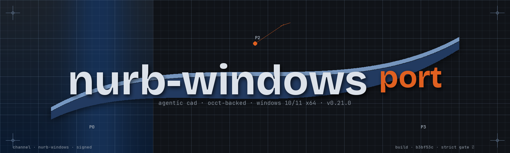

<div align="center">

# `nurb-windows port`

<p align="center">
  
</p>

**Agentic CAD for 3D printing, rebuilt as a first-class Windows application.**
Your agent writes parts as Python functions, nurb builds them into real solids,
checks them against print physics, and shows you the result live. You judge,
drag sliders, download the 3MF.

*A fork of [upstream nurb](https://github.com/Shpigford/nurb) · Windows 10/11 x64 ·
signed auto-updates · NSIS installer · Windows CI*

[](https://github.com/Alot1z/nurb-windows/actions/workflows/windows-build.yml)
[](https://github.com/Alot1z/nurb-windows/releases/latest)
[](https://github.com/Shpigford/nurb)
[](LICENSE)

</div>


## What is this?

**nurb for Windows is a ported fork, not a rewrite.** It takes [upstream nurb](https://github.com/Shpigford/nurb) (agentic CAD on the OCCT kernel, built by Ordinary Systems) and makes Windows a first-class target: a Windows-native desktop app, an NSIS installer, a self-provisioning Python/OCCT runtime, signed auto-updates from this fork's own release channel, and Windows CI. The upstream engine is kept as close to the original as technically possible, so future upstream changes merge back with minimal conflict. Everything upstream runs on macOS and Linux still runs here; the difference is that Windows is now the primary target rather than an afterthought.

- **For people:** download the installer from the [latest release](https://github.com/Alot1z/nurb-windows/releases/latest) and run it. No Python, no uv, no terminal setup: the first launch provisions everything into your app data.
- **For AI agents:** `nurb skill` teaches your agent this fork's conventions, Windows paths (`%APPDATA%\nurb\config.toml`), `viewer.cmd`, and PowerShell included. The design doctrine ships in the package (`nurb rules`) and is the one source of truth.
- **For maintainers:** the fork's merge model, patch register, and sync tooling live in [docs/windows/](docs/windows/).

## Install

The easiest way in is the Windows app. Download `nurb_<version>_x64-setup.exe` from the [latest release](https://github.com/Alot1z/nurb-windows/releases/latest) and run it. Your projects, your AI, and the live viewer in one window; the first launch provisions Python, OCCT, the Node adapters, and the nurb wheel into your app data, and the app updates itself from this fork's release channel. Windows 10/11 x64 is the primary target; the installer is per-user, so no administrator rights are needed.

For the command line on Windows:

```powershell
uv tool install nurb
```

or `pip install nurb`. On macOS and Linux the upstream one-line installer still works (`curl -fsSL https://nurb.dev/install.sh | sh`), and this repo's CLI is drop-in compatible.

## Which model should you use?

nurb works with whatever AI subscription you already pay for, and they are not equally good at designing parts. We run the popular models through the same real part-design jobs and grade the actual geometry by machine, so you can pick based on what you subscribe to and what you are willing to spend: [nurb.dev/benchmarks](https://nurb.dev/benchmarks.html). The raw rows, transcripts, and grading code live in [evals/](evals/).

## Teach your agent

Install the nurb skill once and your agent reaches for nurb on its own whenever you ask for a printable part. `nurb skill` prints the skill file out, and `nurb update` upgrades nurb and rewrites the installed skill to match, so the two move together. The skill is written for the platform it runs on: on Windows it teaches `%APPDATA%\nurb\config.toml`, `viewer.cmd`, and PowerShell, not the Unix equivalents.

## Make something

Open your agent in the directory where the project should live, and talk:

> Make an adapter that connects my shop vac hose to the dust port on my table saw

The agent does the rest: reads the design doctrine, creates the project, models the part, runs the printability checks, and starts `nurb dev` so you get a link to watch. Every save updates the browser without moving your camera, and check findings pin themselves to the geometry. When it looks right: drag the sliders if you want, click `3mf`, print. A `write` button saves your slider values back into the file's defaults, where the agent will see them.

## A part

```python
from nurb import *

@part
def hose_adapter(vac_end=57.6, tool_end=35.0, wall=2.4, draft=False):
    ...
```

The keyword defaults are the parameters. That one declaration drives the CLI, the viewer's sliders, and the tests; there is no schema to keep in sync. A float is a dimension, an int is a count (its slider steps by one). `draft` is passed by the runtime, not callers: when true, skip the polish pass.

The body of a part is [build123d](https://build123d.readthedocs.io) code on the OCCT kernel. That is why the solids are real B-reps with working chamfers, fillets, and STEP export rather than meshes, and why your model already knows the modelling API.

## Commands

```
nurb new <name>     create parts/<name>.py and its card
nurb dev            watch, rebuild, serve the viewer
nurb build [part]   build once and report size
nurb check [part]   run the printability rules, --strict for CI
nurb inspect [part] faces, normals, concave edges, each finding on its face; --render for stills
nurb scan <file>    measure a mesh in mm, a phone scan or a downloaded model (STL/OBJ/GLB or triangulated PLY); --section for a profile polyline
nurb rules          print the design doctrine
nurb api            the vocabulary a part file gets, with signatures
nurb skill          print an agent skill file for your AI harness, --sync rewrites installed copies
nurb update         upgrade nurb, then re-sync the installed skill to match
nurb card [part]    regenerate a card's AUTO block
nurb diff [part]    what moved since the card was written: size, volume, faces, verdict
nurb slice [part]   print time and grams of filament, from the slicer you already have
                    (the viewer's print time row is the same answer, on the part you are looking at)
nurb stress [part]  where a load stresses the part: peak MPa, sag, margin to breaking
                    (the viewer's stress button is the same answer, aimed by clicking the part)
nurb verify [part]  run the doctrine's verification list; --report bundles it with renders
nurb render [part]  write a PNG into build/renders/; --section cuts it open
nurb export [part]  write 3MF into build/, --formats for STL, STEP or GLB
nurb extract        find duplication across parts
nurb launcher       write viewer.cmd, a double-clickable `nurb dev`
```

A project is any directory with a `parts/` folder. No init step. The first `nurb new` in a fresh directory also drops `viewer.cmd`, so a project can be opened from Explorer by double-click from day one; delete it and it stays deleted, `nurb launcher` brings it back on purpose.

## Checks

The agent cannot see, so `nurb check` is its eyes. Rules run against the exact solid, not a mesh, and findings come back as text with coordinates:

```
solids            more than one body, or none: a part that came apart
overhang          downward faces past 45 degrees, bridges told from cantilevers
floating          a region whose first layer would be laid on air
hole_ceiling      a blind hole's flat ceiling, the counterbore case
min_wall          thinnest section, ray cast corrected by an inscribed sphere
sliver            faces too small to print as anything but a smear
concave_cosmetic  polish laid into an inside corner
bed_bevel         polish laid on the edges that meet the build plate
warp_risk         large first layers with corners likely to lift as they cool
pin               a free-standing pin too thin to be more than perimeters
stability         center of mass outside the footprint
projection_ratio  reach over height, for a part cantilevered off a wall
build_volume      does it fit the printer at all
```

Name your machine once in `printer.toml` (`profile = "bambu_a1_mini"`), or try another with `nurb check --printer prusa_mk4s`. The viewer's print time row will also ask you for it the first time you use it, and write the answer here. Better: a printer is a fact about your workshop, not your project, so nurb keeps the standing answers in a per-user config file, `%APPDATA%\nurb\config.toml` on Windows (`~/.config/nurb/config.toml` on macOS and Linux); `printer.toml` wins where they disagree, and `nurb check` says which file supplied the profile. Either file can also name what you print in (`material = "abs"`), and `warp_risk` tightens to match how hard that plastic shrinks. Either file carries the export preference too: an `[export]` table with `formats = ["3mf", "step"]` adds STEP to every `nurb export`, and `--formats` still wins for one run. A part records what it has already justified on its card, so known findings stay silent and new ones are regressions:

```toml
[part]
min_wall = 1.0

[accepted]
sliver = 6
```

When text is not enough, `nurb render <part>` screenshots the viewer so the agent can look at its own work (`uv sync --extra render && uv run playwright install chromium`, the only part of nurb that wants a browser).

## Cards and measurements

Agents forget everything between sessions, so each part gets a card (`parts/<name>.md`): what it is, why, and a `## Don't` section for what was tried and rejected. `nurb card` regenerates its one machine-written block with what only a build can tell you.

Dimensions an agent cannot derive go in `measurements.toml` with how they were obtained; `measured("bracket_pitch")` returns them, and asking for one that is not there raises instead of letting the model guess. A guessed dimension builds, checks clean, prints, and does not fit.

## Variants

The same function flexed is a variant on the card, not a copy of the file:

```toml
[variants.shelf_3x2.params]
grid_x = 3
```

`build`, `check`, `card` and `export` walk variants like parts, so each gets its own 3MF and baselines.

## Layout

```
parts/<name>.py     the part
parts/<name>.md     its card
system.py           optional: shared constants and geometry
measurements.toml   optional: real-world dimensions with provenance
printer.toml        optional: which machine this project prints on
build/              generated exports, gitignored
build/renders/      generated PNGs and verification reports
```

## Speed

`nurb dev` is a long-lived process because importing the kernel costs 45s cold. After that, rebuilds run 30 to 400ms depending on the part, which matters because an agent iterates in save-check cycles, dozens per part.

## The fork

This fork's one rule: upstream changes stay easy to port. The upstream engine is left as-is wherever possible; Windows-specific behavior lives in `src/nurb/platform/` (paths, process launching, executable naming) and in the Tauri desktop under `desktop/`, never scattered as `if sys.platform == "win32"` through the core. That keeps the diff surface small and the merge predictable.

- Upstream core (`src/nurb/`, `tests/`, `examples/`, `skills/`, `evals/`) stays upstream-compatible.
- The Windows desktop (`desktop/src-tauri/`), the NSIS installer, the uv runtime sidecar, the signed updater channel, and the Windows CI are the fork's additions.
- `tools/upstream_sync.py status` shows how far the fork is from upstream and classifies the changed files; `docs/windows/UPSTREAM-SYNC.md` records what a real merge does and the post-merge checklist.
- Every intentional deviation from upstream is listed in `docs/windows/WINDOWS-PATCHES.md`.

Build and release details live in `docs/windows/`: [architecture](docs/windows/ARCHITECTURE.md), [porting](docs/windows/PORTING.md), [release](docs/windows/RELEASE.md), [troubleshooting](docs/windows/TROUBLESHOOTING.md), and [upstream sync](docs/windows/UPSTREAM-SYNC.md).

## Tests

`uv run pytest`. The parts in `examples/` are the calibration set, asserted against dimensions from really-printed parts. Fit tests use literal numbers, never the part's own constants: a model's tests love to agree with its code.

Windows CI (`.github/workflows/windows-build.yml`) runs the Python suite, a Windows portability audit, the desktop frontend tests, and a full installer + signed updater build on every push to `main`.

## Not built yet

- A hosted configurator. `nurb dev` already is one for anybody who can reach it, but publishing without a running kernel is a different problem.
- Measurement tools in the viewer.
- `min_wall` probes sample faces, so a pinch nothing lands near is still missed. A clean result means "no thin walls found", not "no thin walls".
- Authenticode signing of the installer executable itself (SmartScreen). In-app updates are already signed and verified; the installer binary signature is separate and tracked in `docs/windows/RELEASE.md`.

## Debugging the viewer

`window.__nurb` exposes `{ THREE, scene, camera, controls, mesh, ready }`. The URL takes `?part=<name>`, `?view=iso|front|back|left|right|top`, and `?bare`. three.js is vendored in `src/nurb/vendor/three`, so the viewer needs no network; see the README beside it before changing versions.

## License

[FSL-1.1-MIT](LICENSE). Source-available for any purpose except building a competing product, and converts to plain MIT two years after each release.

Copyright 2026 Ordinary Systems LLC.

### Third-party notices

nurb uses **Open CASCADE Technology** (OCCT) for all B-rep geometry, reached through [build123d](https://github.com/gumyr/build123d) (Apache-2.0) and the `OCP` bindings (Apache-2.0). OCCT is licensed under [LGPL-2.1 with an additional exception](https://dev.opencascade.org/resources/licensing). nurb does not redistribute OCCT; it is installed as a dependency and dynamically linked. Bundling nurb into a single-file distribution that embeds OCCT would require shipping the OCCT license and keeping the library replaceable, per LGPL.

nurb **does** redistribute [three.js](https://threejs.org) r169 (MIT), vendored so the viewer works offline, with its `LICENSE` beside it. Same for the viewer's UI font, [JetBrains Mono](https://www.jetbrains.com/lp/mono/) (SIL OFL 1.1), vendored with its `OFL.txt`.

The Windows desktop app is built with [Tauri](https://tauri.app) (MIT or Apache-2.0) and renders through Microsoft's **WebView2** runtime, which the installer bootstraps when it is missing.

Other dependencies: trimesh (MIT), watchdog (Apache-2.0), websockets (BSD-3-Clause), numpy (BSD-3-Clause). Optional, for `nurb render` only: playwright (Apache-2.0).

npm note: nurb has no JavaScript to ship, so PyPI is the only CLI install channel. [`@shpigford/nurb`](https://www.npmjs.com/package/@shpigford/nurb) just points `npx` users here.
